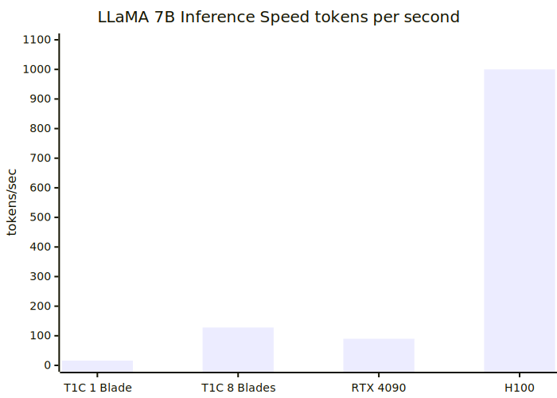
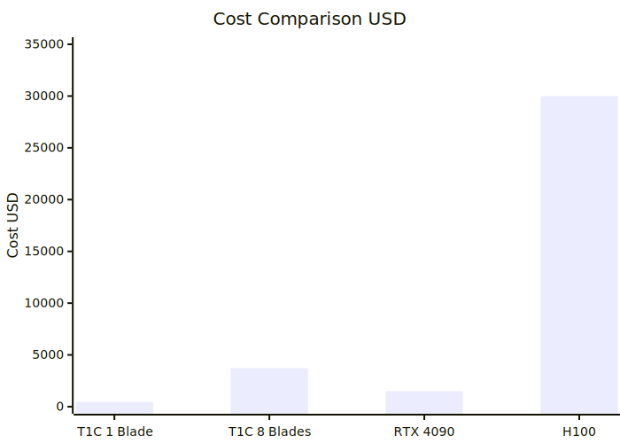
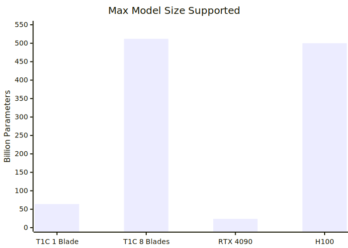

# T1C — Tier 1 Chip

**Open-Source AI Accelerator Architecture. Like RISC-V did for CPUs, T1C does for AI chips.**

[🌐 Visit Site](https://alexzo.vercel.app/t1c) · [📄 Documentation](docs/) · [🤝 Contribute](CONTRIBUTING.md)

> *"We Design It. World Builds It."*

---

## 🧠 Mind Map — T1C Project Overview

---

## ⚡ Why T1C?

| Problem With Current AI Chips | T1C Solution |
|-------------------------------|--------------|
| NVIDIA H100 costs $30,000 | T1C blade costs $280–$650 |
| Closed source — can't modify | Fully open source — MIT license |
| Need special cleanroom | Fabricatable via community shuttles |
| Von Neumann bottleneck | D-IMC — compute inside memory |
| No hardware multi-tenancy (cheap) | MIM — 4 isolated tenants per chip |

---

## 🏗️ Architecture Flowchart

---

## 📊 Performance Comparison

### Performance Table (Honest Numbers)

| System | LLaMA 7B Speed | Max Model | Cost | Open Source |
|--------|---------------|-----------|------|-------------|
| T1C — 1 Blade | 12–20 tok/s | ~64B INT4 | $280–$650 | ✅ MIT License |
| T1C — 8 Blades | 96–160 tok/s | ~512B INT4 | $2,240–$5,200 | ✅ MIT License |
| NVIDIA RTX 4090 | 80–100 tok/s | ~24B FP16 | $1,500 | ❌ Closed |
| NVIDIA H100 | 1000+ tok/s | Unlimited | $30,000 | ❌ Closed |

> **Note:** T1C is not faster than H100. T1C's value is: open source + DIY buildable + hardware tenant isolation + Indian-designed.

---

## 🔧 Data Processing Pipeline

---

## 📁 Repository Structure

---

## 🏭 Fabrication Options

| Method | Node | Cost | Availability |
|--------|------|------|-------------|
| IHP Germany (research) | 130nm | **FREE** | Available now |
| GlobalFoundries 65LP MPW | 65nm | $15–40/chip | Available now |
| Efabless + SkyWater | 130nm | $100–300/slot | Available now |
| Tiny Tapeout | 130nm | ~$100/slot | Available now |

**Start with IHP Germany** — completely free for open source research projects.

---

## 🤝 How To Contribute

We need help with everything! Pick what you know:

### Hardware Engineers
- [ ] Verilog RTL — MAC array module (`rtl/mac_array.v`)
- [ ] Verilog RTL — KV-Cache controller (`rtl/kv_cache.v`)
- [ ] Verilog RTL — DMA engine (`rtl/dma_engine.v`)
- [ ] Verilog RTL — MIM MMU (`rtl/mim_mmu.v`)
- [ ] Verilog RTL — Voltage monitor (`rtl/voltage_monitor.v`)
- [ ] KiCad blade PCB design (`pcb/blade_v1.kicad_pcb`)

### Software Engineers
- [ ] llama.cpp T1C backend (`software/llama_cpp_backend/`)
- [ ] Verilator simulation model (`sim/maau_verilator/`)
- [ ] Python assembler (`tools/assembler/`)
- [ ] Linux kernel driver (`software/kernel_driver/`)
- [ ] ONNX Runtime provider (`software/onnx_provider/`)

### Anyone
- [ ] Documentation improvements
- [ ] Translation to other languages
- [ ] Blog posts and tutorials
- [ ] Testing and bug reports

See [CONTRIBUTING.md](CONTRIBUTING.md) for full details.

---

## 📜 License

MIT License — Alexzo / Sarthak

Free to use, modify, fabricate, and sell. Attribution appreciated but not legally required.

---

## 🔗 Links

- **Website:** [alexzo.vercel.app/t1c](https://alexzo.vercel.app/t1c)
- **Brand:** Alexzo (alexzo.vercel.app)
- **Founder:** Sarthak
- **Documentation:** See `/docs/` folder

---

*"Real Engineering. Honest Numbers. Open Future. From India — For the World."*
