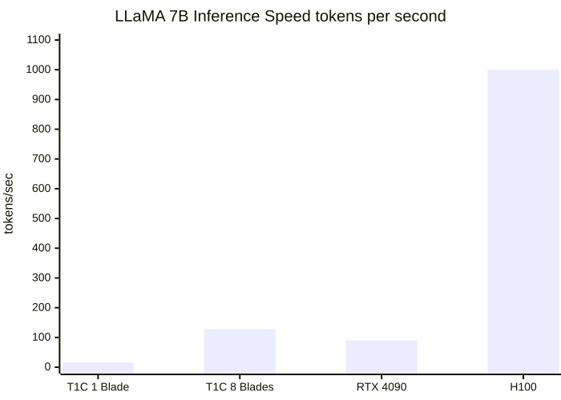
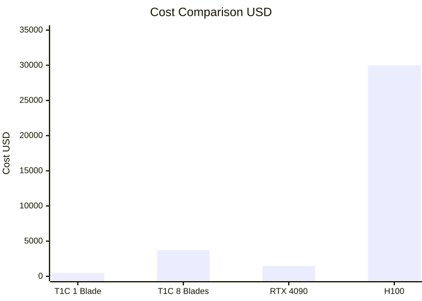
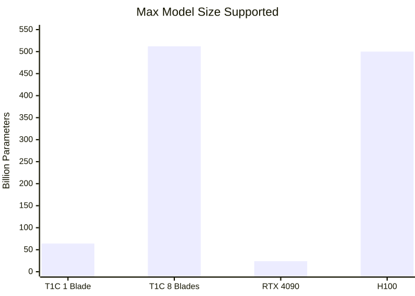

# T1C: Open-Source AI Accelerator Chip for LLM Inference | ADDX Entp

**Build the future of open AI hardware: an open-source accelerator chip architecture for efficient, affordable, community-built LLM inference.**

T1C is an **open-source AI accelerator chip project** by **ADDX Entp**, created by [Sarthak](https://github.com/sarthakpandey-official). It explores digital in-memory computing (D-IMC), memory-isolated multi-tenancy, open silicon, and practical hardware for large language model (LLM) inference. Explore the project at [addx.pages.dev](https://addx.pages.dev).

[🌐 Visit Site](https://addx.pages.dev) · [📄 Documentation](docs/) · [🤝 Contribute](CONTRIBUTING.md)

> *"We Design It. World Builds It."*

---

## About ADDX Entp and T1C

T1C is designed to make AI accelerator research more open, understandable, and buildable. The project combines hardware architecture, chip fabrication planning, an instruction-set specification, simulation placeholders, and community contribution paths in one public repository.

**Project:** T1C — Tier 1 Chip  
**Brand:** ADDX Entp  
**Created by:** [Sarthak](https://github.com/sarthakpandey-official)  
**Official site:** [addx.pages.dev](https://addx.pages.dev)

---

## 🧠 Mind Map — T1C Project Overview

---

## ⚡ Why T1C?

| Problem With Current AI Chips | T1C Solution |
|-------------------------------|--------------|
| NVIDIA H100 costs $30,000 | T1C blade costs $280–$650 |
| Closed source — can't modify | Fully open source — MIT license |
| Need special cleanroom | Fabricatable via community shuttles |
| Von Neumann bottleneck | D-IMC — compute inside memory |
| No hardware multi-tenancy (cheap) | MIM — 4 isolated tenants per chip |

---

## 🏗️ Architecture Flowchart

---

## 📊 Performance Comparison

### Performance Table (Honest Numbers)

| System | LLaMA 7B Speed | Max Model | Cost | Open Source |
|--------|---------------|-----------|------|-------------|
| T1C — 1 Blade | 12–20 tok/s | ~64B INT4 | $280–$650 | ✅ MIT License |
| T1C — 8 Blades | 96–160 tok/s | ~512B INT4 | $2,240–$5,200 | ✅ MIT License |
| NVIDIA RTX 4090 | 80–100 tok/s | ~24B FP16 | $1,500 | ❌ Closed |
| NVIDIA H100 | 1000+ tok/s | Unlimited | $30,000 | ❌ Closed |

> **Note:** T1C is not faster than H100. T1C's value is: open source + DIY buildable + hardware tenant isolation + Indian-designed.

---

## 🔧 Data Processing Pipeline

---

## 📁 Repository Structure

---

## 🏭 Fabrication Options

| Method | Node | Cost | Availability |
|--------|------|------|-------------|
| IHP Germany (research) | 130nm | **FREE** | Available now |
| GlobalFoundries 65LP MPW | 65nm | $15–40/chip | Available now |
| Efabless + SkyWater | 130nm | $100–300/slot | Available now |
| Tiny Tapeout | 130nm | ~$100/slot | Available now |

**Start with IHP Germany** — completely free for open source research projects.

---

## 🤝 How To Contribute

We need help with everything! Pick what you know:

### Hardware Engineers
- [ ] Verilog RTL — MAC array module (`rtl/mac_array.v`)
- [ ] Verilog RTL — KV-Cache controller (`rtl/kv_cache.v`)
- [ ] Verilog RTL — DMA engine (`rtl/dma_engine.v`)
- [ ] Verilog RTL — MIM MMU (`rtl/mim_mmu.v`)
- [ ] Verilog RTL — Voltage monitor (`rtl/voltage_monitor.v`)
- [ ] KiCad blade PCB design (`pcb/blade_v1.kicad_pcb`)

### Software Engineers
- [ ] llama.cpp T1C backend (`software/llama_cpp_backend/`)
- [ ] Verilator simulation model (`sim/maau_verilator/`)
- [ ] Python assembler (`tools/assembler/`)
- [ ] Linux kernel driver (`software/kernel_driver/`)
- [ ] ONNX Runtime provider (`software/onnx_provider/`)

### Anyone
- [ ] Documentation improvements
- [ ] Translation to other languages
- [ ] Blog posts and tutorials
- [ ] Testing and bug reports

See [CONTRIBUTING.md](CONTRIBUTING.md) for full details.

---

## 📜 License

MIT License — ADDX Entp

Free to use, modify, fabricate, and sell. Attribution appreciated but not legally required.

---

## 🔗 Links

- **Website:** [addx.pages.dev](https://addx.pages.dev)
- **Brand:** ADDX Entp ([addx.pages.dev](https://addx.pages.dev))
- **Created by:** [Sarthak](https://github.com/sarthakpandey-official)
- **GitHub:** [sarthakpandey-official](https://github.com/sarthakpandey-official)
- **Documentation:** See `/docs/` folder

---

## Star History

<a href="https://www.star-history.com/?repos=addxofficial%2Ft1c&type=date&legend=top-left">
  <picture>
    <source media="(prefers-color-scheme: dark)" srcset="https://api.star-history.com/chart?repos=addxofficial/t1c&type=date&theme=dark&legend=top-left" />
    <source media="(prefers-color-scheme: light)" srcset="https://api.star-history.com/chart?repos=addxofficial/t1c&type=date&legend=top-left" />
    
  </picture>
</a>

This chart shows the repository’s real public star history over time. It is an external visualization, not a fabricated ranking or traffic graph.

---

## Project Status & Transparency

T1C is an **actively documented AI accelerator chip architecture** designed by **ADDX Entp** and created by [Sarthak](https://github.com/sarthakpandey-official). The repository contains the architecture, instruction-set specification, design documentation, fabrication planning, and community contribution paths. At this stage, T1C is a **design and research project**; it has **not yet been taped out, fabricated, or brought to silicon**. Hardware validation, physical implementation, tape-out, and silicon testing remain future milestones.

The project is intended to grow through transparent engineering, public documentation, peer review, contributors, issues, pull requests, stars, forks, and real-world community adoption. No artificial traffic, fabricated ranking, or guaranteed viral growth is claimed.

*"Real Engineering. Honest Numbers. Open Future. From India — For the World."*
